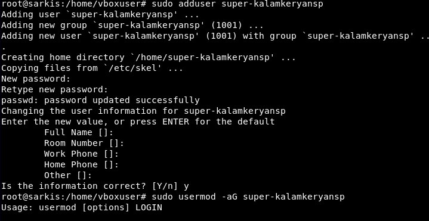
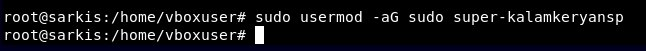
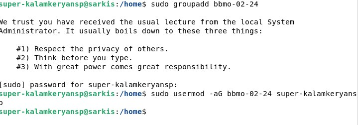
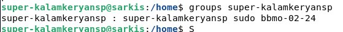
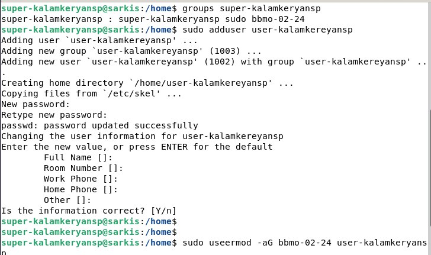
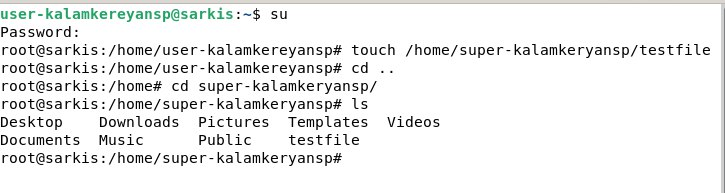

1. Создать виртуальную машину на базе ОС Debian 12
2. Создать пользователя super-{ФИО}, наделить его привилегиями суперпользователя
3. Зайти под созданным пользователем и создать группу group-{группа}
4. Добавить пользователя super-{ФИО} в группу group-{группа}
5. Продемонстрировать наличие пользователя в группе
6. Создать пользователя user-{ФИО}, добавить его в группу group-{группа}
7. Наделить полномочиями (с использованием механизмов дискреционного управления доступом chmod) пользователя user-{ФИО} по созданию и удалению файлов в домашнем каталоге пользователя super-{ФИО}
8. Продемонстрировать работу механизмов разграничения доступа.

Cоздав виртуальную машину приступаем к созданию пользователя 

Cоздание пользователя user-{ФИО}

Наделив пользователя полномочиями добавляем файл в домашнем каталоге super пользователя

